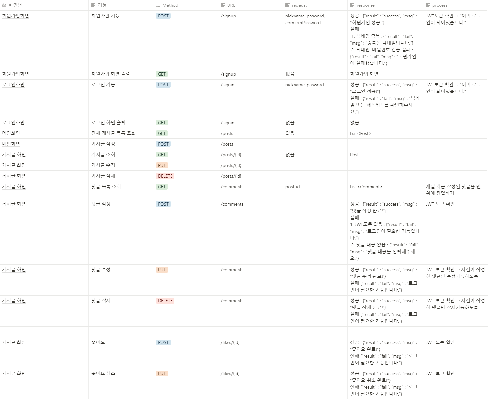
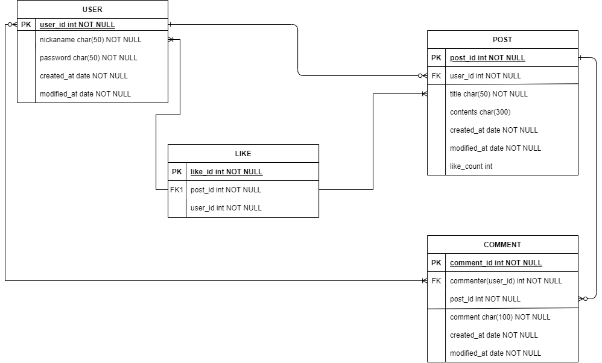

# 프로젝트 개요

- 프로젝트 명 : 스프링 숙련 주차 개인 과제
- 프로젝트 설명
    - 회원가입, 로그인, 댓글 작성/수정/삭제 기능이 추가된 나만의 항해 블로그 백엔드 서버 만들기
- 환경설정
    - Java8
    - Spring
    - Lombok
    - Spring-Web
    - H2
    - MySQL
    - Thymeleaf
    - Spring-Security
    - JPA

## 과제 요구사항

1. 프로젝트 구성
    - Springboot 2.6.9 이하 버전으로 프로젝트를 생성하세요
        - 현재 블로그, 강의자료 등 참조할 수 있는 레퍼런스들은 2.7미만에서 동작합니다. 2.7버전 이상에서 구현시 공식문서만 참조하여 구현하여야 합니다.
    - jwt 를 사용하여 로그인, 회원 기능을 구현하세요
        - 아래 요구사항에서 언급되는 토큰은 Jwt를 의미합니다.
2. 회원 가입 API
    - 닉네임, 비밀번호, 비밀번호 확인을 request에서 전달받기
    - 닉네임은 `최소 3자 이상, 알파벳 대소문자(a~z, A~Z), 숫자(0~9)`로 구성하기
    - 비밀번호는 `최소 4자 이상이며, 닉네임과 같은 값이 포함된 경우 회원가입에 실패`로 만들기
    - 비밀번호 확인은 비밀번호와 정확하게 일치하기
    - 데이터베이스에 존재하는 닉네임을 입력한 채 회 원가입 버튼을 누른 경우 "중복된 닉네임입니다." 라는 에러메세지를 response에 포함하기
3. 로그인 API
    - 닉네임, 비밀번호를 request에서 전달받기
    - 로그인 버튼을 누른 경우 닉네임과 비밀번호가 데이터베이스에 등록됐는지 확인한 뒤, 하나라도 맞지 않는 정보가 있다면 "닉네임 또는 패스워드를 확인해주세요"라는 에러 메세지를 response에 포함하기
4. 로그인 검사
    - `아래 API를 제외하고` 모두 로그인 토큰을 전달한 경우만 정상 response를 전달받을 수 있도록 하기
        - 회원가입 API
        - 로그인 API
        - 게시글 목록 조회 API
        - 게시글 조회 API
        - 댓글 목록 조회 API
    - 로그인 토큰을 전달하지 않은 채로 로그인이 필요한 API를 호출한 경우 "로그인이 필요합니다." 라는 에러 메세지를 response에 포함하기
    - 로그인 토큰을 전달한 채로 로그인 API 또는 회원가입 API를 호출한 경우 "이미 로그인이 되어있습니다."라는 에러 메세지를 response에 포함하기
5.  댓글 목록 조회 API
    - 로그인 토큰을 전달하지 않아도 댓글 목록 조회가 가능하도록 하기
    - 조회하는 게시글에 작성된 모든 댓글을 목록 형식으로 response에 포함하기
    - 제일 최근 작성된 댓글을 맨 위에 정렬하기
6. 댓글 작성 API
    - 로그인 토큰을 전달했을 때에만 댓글 작성이 가능하도록 하기
    - 로그인 토큰을 전달하지 않은 채로 댓글 작성란을 누르면 "로그인이 필요한 기능입니다." 라는 에러 메세지를 response에 포함하기
    - 댓글 내용란을 비워둔 채 API를 호출하면 "댓글 내용을 입력해주세요" 라는 에러 메세지를 response에 포함하기
7. 댓글 수정 API
    - 로그인 토큰에 해당하는 사용자가 작성한 댓글만 수정 가능하도록 하기
    - API를 호출한 경우 기존 댓글의 내용을 새로 입력한 댓글 내용으로 바꾸기
8. 댓글 삭제 API
    - 로그인 토큰에 해당하는 사용자가 작성한 댓글만 삭제 가능하도록 하기
9. 회원가입 테스트 코드 작성
    - 회원가입시 구현한 아래 조건을 검사하는 테스트 코드를 작성하기
        - 닉네임은 `최소 3자 이상, 알파벳 대소문자(a~z, A~Z), 숫자(0~9)`로 이루어져 있어야 합니다.
        - 비밀번호는 `최소 4자 이상이며, 닉네임과 같은 값이 포함된 경우 회원가입에 실패`합니다.
        - 비밀번호 확인은 비밀번호와 정확하게 일치해야 합니다.
        - 데이터베이스에 존재하는 닉네임을 입력한 채 회원가입 버튼을 누른 경우 "중복된 닉네임입니다." 라는 에러 메세지를 response에 포함하기
    - 테스트 코드 실행 시 실제로는 데이터베이스에 연결되지 않도록 하기
    - 각 조건 별로 2개 이상의 테스트 케이스가 존재하도록 하기

## 추가 요구사항

1. 내 블로그 글에 좋아요 기능 달기
    - 로그인 토큰을 전달했을 때에만 좋아요 할 수 있게 하기
    - 로그인 토큰에 해당하는 사용자가 좋아요 한 글에 한해서, 좋아요 취소 할 수 있게 하기
    - 게시글 목록 조회시 글의 좋아요 갯수도 같이 표출하기
2. 내 프로젝트에 swagger 적용해보기
    - swagger란? Open Api Specification(OAS)를 위한 프레임워크 입니다. API들이 가지고 있는 스펙(spec)을 명세, 관리할 수 있으며, 백엔드와 프론트엔드가 협업할 때 사용할 수 있습니다!

<aside>
⚠️ Warning : 꼭 지켜야 할 것과 하지 않아도 되는 것!

</aside>

- 이것은 꼭 지켜주세요(Do's)
    - 과제 요구 사항은 모두 지켜주세요. 특정 기능을 임의로 배제하면 안 됩니다!
- 이것은 하지 않으셔도 돼요(Don'ts)
    - 프론트엔드 페이지는 설계하지 않으셔도 됩니다. 여력이 남으시면 하셔도 좋지만, 일단은 API 구현과 설계에 집중해주세요!
    - 과제 추가 기획 때문에 고민하지 마세요. 위에 작성된 과제 요구 사항만 지키면 됩니다!

      → 좋은 예 (⭕): "아하, 결국 Spring Boot로 기본 CRUD와 로그인이 가능한 서비스를 만들고 배포하면 되는거구나!"

      → 나쁜 예 (❌): "다른 기능이 더 있어야 하지 않을까?"

## API 설계

## DB 설계
